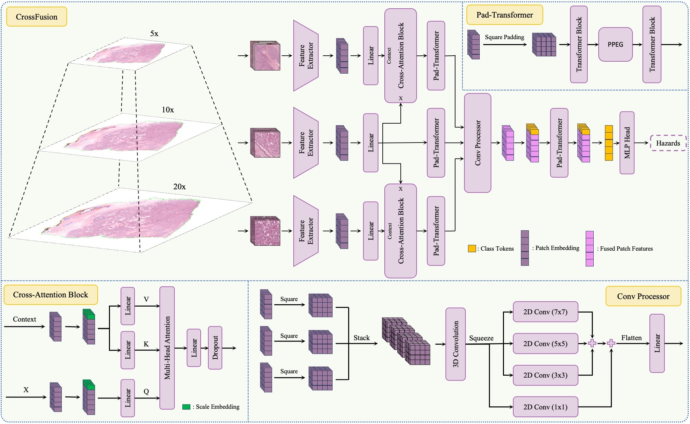

# CrossFusion

<details>
<summary>
  <b>CrossFusion: A Multi-Scale Cross-Attention Convolutional Fusion Model for Cancer Survival Prediction</b>
  <a href="https://arxiv.org/abs/2503.02064" target="blank">[arXiv]</a>
	<br><em>Rustin Soraki, Huayu Wang, Joann G. Elmore, Linda Shapiro</em></br>
</summary>

```bash
@misc{soraki2025crossfusionmultiscalecrossattentionconvolutional,
      title={CrossFusion: A Multi-Scale Cross-Attention Convolutional Fusion Model for Cancer Survival Prediction}, 
      author={Rustin Soraki and Huayu Wang and Joann G. Elmore and Linda Shapiro},
      year={2025},
      eprint={2503.02064},
      archivePrefix={arXiv},
      primaryClass={eess.IV},
      url={https://arxiv.org/abs/2503.02064}, 
}
```
</details>

<br />

<p align="center">

</p>

**Abstract:** Cancer survival prediction from whole slide images (WSIs) is a challenging task in computational pathology due to the large size, irregular shape, and high granularity of the WSIs. These characteristics make it difficult to capture the full spectrum of patterns, from subtle cellular abnormalities to complex tissue interactions, which are crucial for accurate prognosis. To address this, we propose CrossFusion—a novel, multi-scale feature integration framework that extracts and fuses information from patches across different magnification levels. By effectively modeling both scale-specific patterns and their interactions, CrossFusion generates a rich feature set that enhances survival prediction accuracy. We validate our approach across six cancer types from public datasets, demonstrating significant improvements over existing state-of-
the-art methods. Moreover, when coupled with domain-specific feature extraction backbones, our method shows further gains in prognostic performance compared to general-purpose backbones

# Installation

If you wish to install and run the code in this repository, use the provided `environment.yml` file to set up the necessary environment:

**1\. Download the repository** (or clone it using git):

```shell
git clone https://github.com/RustinS/CrossFusion.git
cd CrossFusion
```

**2\. Create the Conda environment from the provided file**:

```shell
conda env create -f environment.yml
```

**3\. Activate the newly created environment**:

```shell
conda activate crossfusion
```


## Downloading TCGA Data

To download diagnostic WSIs (formatted as .svs files), please refer to the [NIH Genomic Data Commons Data Portal](https://portal.gdc.cancer.gov/). We used WSIs from these studies: *BLCA*, *BRCA*, *COAD*, *LUAD*, *GB&LGG*, and *UCEC*. WSIs for each cancer type can be downloaded using the [GDC Data Transfer Tool](https://docs.gdc.cancer.gov/Data_Transfer_Tool/Users_Guide/Data_Download_and_Upload/).

## WSI Processing and Embedding

We use the methodology outlined in [CLAM](https://github.com/mahmoodlab/CLAM) to create and embed patches from whole-slide images (WSIs). The patches are extracted at a fixed size of 256×256 pixels from three magnification levels: 20x, 10x, and 5x.

Since WSIs from the TCGA dataset have varying maximum magnifications, the actual magnification corresponding to each resolution level can differ. For instance, level 0 corresponds to a 40x magnification for WSIs with a maximum magnification of 40x, but it represents 20x magnification for WSIs with a maximum of 20x.

As an example, to generate 20x patches from WSIs with a 40x maximum magnification, we first extract 512×512 pixel patches at level 0. These patches are then resized to 256×256 pixels during the feature extraction phase. We subsequently follow CLAM's procedure to store patch coordinates and extracted features.

## Training and Evaluation

To train the model, please follow these steps using the provided `train.sh` script:

## 1. Set Up Paths

In the `train.sh` file, update the following variables to match your system's directory structure:

- `img_dir`: Path to the directory containing patch images.
- `pt_dir`: Path to the directory containing extracted features.
- `save_dir`: Path to the directory where trained models and outputs will be saved.

Other necessary data path configurations reference data stored in the repository's `data` folder. Ensure these paths and filenames correctly reflect your local setup.

## 3. Choose Backbone Model

Specify your desired backbone model used for extracting features with CLAM by setting the appropriate `backbone` name and its dimensions within `train.sh`. We've included examples of backbones we've tested, but you're free to use any compatible backbone.

## 4. Adjust Hyperparameters

Review and adjust additional hyperparameters within the `train.sh` file as needed to align with your experimental goals. The hyperparameters in the current version of the `train.sh` file is the one we used for the experiments.

Finally, to start the training, you can do:

```shell
sh train.sh
```

You can then evaluate the trained model on a dataset using:

```shell
sh eval.sh
```

The list of variables in the `eval.sh` file should closely follow the list in the `train.sh` file.